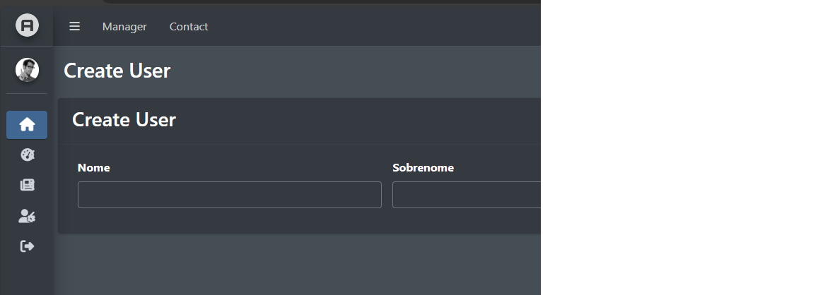

## Índice
* [Índice](#%C3%ADndice)
* [Introdução](#iVertion-Palladium)
    * [Autores](#Autores)
    * [Ambiente de desenvolvimento](#Ambiente-de-desenvolvimento)
        * [Windows](#Windows)
            * [Xampp](#XAMPP)
            * [iVertion WebApi](#iVertion-WebApi)
                * [.NET](#.NET)
            * [iVertion Client](#iVertion-Client)
                * [Node JS](#Node-JS)
                * [Angular JS](#Angular-JS)
    * [Contribuindo](#Contribuindo)
        * [Projeto Client](#Projeto-Client)
    * [Deploy](#Deploy)
            
# iVertion-Palladium

Simples, Poderoso, iVertion: O ERP da Sua Empresa.

Em um momento de intensa reflexão sobre a missão de revolucionar a gestão empresarial, a equipe fundadora do iVertion se encontrou imersa em um redemoinho de ideias. Buscavam não apenas um nome, mas uma identidade que encapsulasse a essência do que estavam prestes a oferecer ao mundo dos negócios.

A primeira sílaba, o "i", foi escolhida como um elo simbólico com a era digital, representando a interconexão e a inteligência que impulsionaria o software. Era mais do que uma simples referência à internet; era um convite para a integração, a inovação e a inteligência, os pilares essenciais que moldariam cada linha de código.

A segunda parte, "Vertion", foi criada a partir de uma fusão de duas palavras poderosas: "versão" e "inovação". Essa fusão foi um epifânico insight da equipe, simbolizando não apenas a evolução constante do produto, mas também a inversão de paradigmas tradicionais nos processos de gestão. Era uma promessa de transformar a maneira como as empresas operavam, uma versão completamente nova do que o mundo corporativo já conhecia.

Assim, "iVertion" nasceu não apenas como um nome, mas como uma declaração de intenções. Cada letra, cada sílaba, carrega consigo o compromisso de impulsionar as empresas para o futuro, através de uma plataforma que não apenas acompanha, mas antecipa e inspira a mudança.

A proposta dessa aplicação é oferecer um ERP completo com módulos que vão desde a administração do sistema e configuração, RH, Financeiro e Fiscal até Linha de Produção, Estoque e E-Commerce.


## Autores

- [@Eduardo Rodrigo Spada](https://www.github.com/eduardorspada)

- [@Rudymar Renato Spada](https://github.com/rudymarspd?tab=overview&from=2024-01-01&to=2024-01-17)

## Ambiente de desenvolvimento

### Windows

As configurações a seguir devem ser executadas no ambiente de desenvolvimento para executar as aplicações no Windows. Recomenda-se usar distribuições do Windows 10 ou 11.

#### XAMPP
Para rodar localmente, precisamos configurar inicialmente um banco de dados MySql ou MariaDB. Vamos utilizar o Xampp para Windows, ele virá preparado para rodar localmente sem muitas dificuldades no Windows.

Inicialmente realize o download abaixo:

- [Xampp 8.2.12](https://sourceforge.net/projects/xampp/files/XAMPP%20Windows/8.2.12/xampp-windows-x64-8.2.12-0-VS16-installer.exe)

Realize a instalação segundo wizard, apenas clique em next, next!

Após instalar, inicie os serviços Apache e MySql (MariaDB).

Quando os serviços estiverem ativos, clique admin no serviço do MySql, nesse momento o seu navegador padrão deve entrar no PhpMyAdmin.

No PhpMyAdmin crie um novo banco de dados com a nomeclatura *ivertion*, na codificação deixe padrão do PhpMyAdmin.


### iVertion WebApi
O iVertion WebApi é o backend da aplicação, foi desenvolvido com .NET 8, MySql como banco de dados (opcional MariaDB).

O projeto tem toda a estrutura com *Clean Architecture*, usa os padrões do *S.O.L.I.D* como princípios de boas práticas.

A abordagem *Code First* foi utilizada em conjunto com o ORM *Entity Framework*, isso tende a facilitar o deploy, assim como possíveis adaptações a certas necessidades como por exemplo a mudança da tecnologia de banco de dados empregada caso necessário.

A documentação é gerada automaticamente pelo *Swagger*, o que facilita o entendimento dos endpoints.

A proposta da API é servir um ERP robusto com inúmeras opções de módulos, e o objetivo é se tornar uns dos maiores ERPs do mercado na atualidade. 

#### .NET

Para o projeto API em ambiente de desenvolvimento, vamos instalar as dependências a seguir:

 - Versão Atual: 8.0.101
 - [Baixe aqui](https://download.visualstudio.microsoft.com/download/pr/cb56b18a-e2a6-4f24-be1d-fc4f023c9cc8/be3822e20b990cf180bb94ea8fbc42fe/dotnet-sdk-8.0.101-win-x64.exe)

#### Testando a instalação do .NET:

Teste a instalação do .NET com o seguinte comando:

```bash
dotnet --list-sdks
```

Se a versão *6.0.418* estiver na lista, isso significa que a instalação do .NET 6 foi um sucesso.

#### Entity Framework Core .NET Command-line Tools 6.0.13

Após a instalação do .NET 6, precisamos instalar a ferramenta do Entity Framework para habilitar as migrações de banco de dados. Para isso execute no terminal o seguinte comando. 

```bash
dotnet tool install --global dotnet-ef --version 8.0.1
```
#### Testando o Entity Framework
Agora vamos testar o Entity Framework.

Em um novo terminal execute o comando abaixo:

```bash
dotnet ef
```

A saída deve ser algo como isto:

```bash
        
                     _/\__       
               ---==/    \\      
         ___  ___   |.    \|\    
        | __|| __|  |  )   \\\   
        | _| | _|   \_/ |  //|\\ 
        |___||_|       /   \\\/\\

Entity Framework Core .NET Command-line Tools 8.0.1

Usage: dotnet ef [options] [command]

Options:
  --version        Show version information
  -h|--help        Show help information
  -v|--verbose     Show verbose output.
  --no-color       Don't colorize output.
  --prefix-output  Prefix output with level.

Commands:
  database    Commands to manage the database.
  dbcontext   Commands to manage DbContext types.
  migrations  Commands to manage migrations.

Use "dotnet ef [command] --help" for more information about a command.

```


#### Gerando os arquivos de migração com o Entity Framework

Para gerar os arquivos de migração, vamos executar alguns passos no terminal.

Certifique-se de estar na raiz do projeto **API**.

Execute o comando abaixo para gerar uma nova migração:

```bash
dotnet ef  migrations add initial --project iVertion.Infra.Data -s iVertion.WebApi -c ApplicationDbContext --verbose
```

Ao decorrer do desenvolvimento teremos novas migrações, o padrão adotado para o nome será *release-x.x.x*.

O projeto atualiza as migrações sempre no momento da execução, nesse caso não é necessário executar o update, mas para deixar documentado, caso execute, o comando é:

```bash
dotnet ef  database update --project iVertion.Infra.Data -s iVertion.WebApi -c ApplicationDbContext --verbose 
```

#### Executando a **API**

Após o ambiente de desenvolvimento do .NET configurado, vamos iniciar o projeto **API**, lembre-se de estar na raiz do projeto API para executar os comandos.

A seguir vamos atualizar os pacotes do projeto, dessa forma garantimos que as dependências sejam instaladas corretamente.

```bash
dotnet restore
```
Agora vamos compilar a aplicação para evitar erros na execução do projeto.

```bash
dotnet build
```
E por fim, vamos executar o projeto, o comando abaixo executa o projeto **API** a partir da camada *iVertion.WebApi*, o argumento *watch* é opcional, é utilizado especialmente para realizar algumas alterações com o projeto em execução, mas não necessário para o consumo da API em si.


```bash
dotnet watch run --project .\iVertion.WebApi\iVertion.WebApi.csproj
```

#### Acessando a documentação da **API**.

Quando o projeto estiver executando, acesse a documentação do Swagger no link abaixo:

- [iVertion WebApi - Swagger](http://localhost:5001/swagger/index.html)

A documentação apresentada terá as informações necessárias para o consumo correto da **API** no frontend. Recomendamos o uso do [Postman](https://www.postman.com/) para testes.

Para facilitar os testes, criamos o arquivo [iVertion.postman_collection.json](https://github.com/eduardorspada/iVertion-Palladium/blob/main/API/iVertion.postman_collection.json) que pode ser importado já com algumas coleções devidamente configuradas.

Os testes podem ser executados diretamente no Swagger, mas não será possível salvar os parâmetros.


### iVertion Client

O iVertion Client é o frontend da aplicação, desenvolvido com Angular JS.

A arquitetura utilizada é MVC (Model, View, Controler) que é um padrão do Angular JS, essa camada usa alguns preceitos importantes para uma aplicação segura e ao mesmo tempo eficiente.

#### Node JS

Realize o download da versão atual utilizada na aplicação no link a seguir:

- [Node JS - v20.11.0](https://nodejs.org/dist/v20.11.0/node-v20.11.0-x64.msi)

Realize a instalação seguindo os passos do *wizard*. 

#### Realizando testes da instalação


Em um terminal execute o comando a seguir:

```bash
node -v
```

Esse comando deve retornar a versão instalada.

```
v20.11.0
```

Se o retorno for o mesmo que o valor acima, o processo de instalação foi um sucesso.

Verifique o **npm** executando o comando:

```bash
npm -v
```
Se o retorno for algo parecido com o resultado abaixo, o **npm** está ativo para uso também

```
10.4.0
```

#### Angular

Para instalar a versão atual do Angular, abra um terminal e execute o comando abaixo:

```bash
npm install -g @angular/cli@17.1.2
```

** *Não execute o comando acima dentro do projeto.*

#### Testando a instalação

Execute o comando abaixo para verificar se o ambiente está preparado para o desenvolvimento.

```bash
npx ng version
```

O retorno deve ser semelhante a isto:

```bash

     _                      _                 ____ _     ___
    / \   _ __   __ _ _   _| | __ _ _ __     / ___| |   |_ _|
   / △ \ | '_ \ / _` | | | | |/ _` | '__|   | |   | |    | |
  / ___ \| | | | (_| | |_| | | (_| | |      | |___| |___ | |
 /_/   \_\_| |_|\__, |\__,_|_|\__,_|_|       \____|_____|___|
                |___/


Angular CLI: 17.1.1
Node: 20.11.0
Package Manager: npm 10.4.0
OS: win32 x64

Angular: 17.1.2
... animations, common, compiler, compiler-cli, core, forms
... platform-browser, platform-browser-dynamic, router

Package                         Version
---------------------------------------------------------
@angular-devkit/architect       0.1701.1
@angular-devkit/build-angular   17.1.1
@angular-devkit/core            17.1.1
@angular-devkit/schematics      17.1.1
@angular/cli                    17.1.1
@schematics/angular             17.1.1
rxjs                            7.8.1
typescript                      5.2.2
webpack                         5.89.0
zone.js                         0.14.3

```

#### Instalando as dependências do projeto

Agora que o ambiente de desenvolvimento Angular JS está funcionando, vamos instalar as dependências do projeto, para isso, certifique-se de estar na raiz do projeto **Client** e execute o comando abaixo:

```bash
npm install
```

#### Executando o projeto **Client**

O projeto **Client** é dependente do projeto **API**, portanto, execute-o primeiro.

Quando o projeto **API** estiver executando conforme a documentação, vamos executar o projeto **Client** executando o comando abaixo na raiz do projeto **Client**.

```bash
npx ng serve
```

Se não houver nenhum erro, após o build, o prjeto deve estar disponível no link abaixo:

- [Projeto **Client**](http://localhost:4200/)


## Contribuindo

Contribuições são sempre bem-vindas!

Por favor, siga o `código de conduta` desse projeto.


### Projeto **Client**

#### Tratamento dos dados

Nesse projeto estamos trabalhando com dois tipos de tratamento de dados, o primeiro é a *concatenação* e o segundo é o *two way data binding*

- ***Concatenação*** - Para concatenar dados estáticos em uma view, user a seguinte sintaxe `{{model.data}}`, onde `model` é o objeto da view e `data` trata-se da propriedade a ser disponibilizada.

Exemplo:

```html
<div class="card-header">
    <div class="row">
        <div class="col-sm-1">
            <h3>Artigo</h3>
        </div>
        <div class="col-sm-5">
            <dl class="row">
                <dt class="col-sm-1">ID:</dt>
                <dl class="col-sm-2"># {{article.id}}</dl>
            </dl>
        </div>
    </div>
</div>
```

- ***Two Way Data Binding*** - Esse é um conceito central no AngularJS, onde as alterações feitas no modelo são refletidas automaticamente na visão e vice-versa, eliminando a necessidade de manipulação manual do DOM. A sintaxe utilizada será `[(ngModel)]="model.data"` onde `model` é o objeto da view e `data` trata-se da propriedade a ser disponibilizada. `ngModel` é uma palavra reservada do *Angular*.

Exemplo:

```html
<div class="col-md-6">
    <div class="form-group">
        <label for="title">Título</label>
        <input type="text" name="title" id="title" class="form-control" [(ngModel)]="article.title">
    </div>
</div>
```

** *Note que o **Two Way Data Binding** é utilizado em formulários*.


#### Criando views

O *Angular* é modular, isso significa que as views são componentes que podem ou não fazer parte de um módulo criado pelo desenvolvedor, quando não fazem parde de um módulo criado pelo desenvolvedor, quando não, farão parte do `app.module.ts` que é o módulo principal do projeto.

Para criar um módulo usaremos o comando a seguir:

```bash
npx ng g m nome-do-modulo
```

** *Note que em `nome-do-modulo` separamos cada palavra por hifens, esse será o padrão para módulos e componentes*.

Exemplos:

```bash
npx ng g m articles
```
```bash
npx ng g m users-groups
```

Um módulo pode conter rotas, recomendamos especialmente quando tiver muitos componentes. Para criar um módulo com rotas, use o parâmetro `--routing` no final do comando.

Exemplo:
```bash
npx ng g m users --routing
```

Entendendo os comandos acima.

- `npx` - É um utilitário do Node.js que permite executar pacotes Node.js como se fossem aplicativos instalados globalmente. A sigla "npx" significa Node Package eXecute. Ele é útil para executar comandos de pacotes que normalmente não estão instalados globalmente.

- `ng` - Este é o comando principal do Angular CLI. É uma ferramenta de linha de comando para criar, gerenciar, construir e testar aplicações Angular.

- `g` - É a abreviação de "generate" (gerar, em português). Esse comando é usado para gerar novos elementos em uma aplicação Angular, como componentes, serviços, módulos, etc.

- `m` - É a abreviação de "module" (módulo, em português). Módulos são conjuntos de funcionalidades agrupadas, que podem incluir componentes, serviços, diretivas, pipes, e outros módulos.

- `users` - Este é o nome do módulo que será criado. Neste caso, o comando criará um módulo chamado "users".

- `--routing` - Esta opção indica que o Angular CLI deve também criar um arquivo de roteamento específico para o módulo. Normalmente, este arquivo é usado para definir as rotas associadas aos componentes dentro do módulo. A inclusão da opção --routing gera um arquivo adicional de configuração de rotas (como users-routing.module.ts), que facilita a organização das rotas do módulo "users".

Agora vamos conhecer os comandos para criar as views de fato que nesse caso serão nossos componentes, neles teremos o html, as folhas de estilos, estamos usando `SCSS` para esse projeto, um arquivo de testes e o arquivo do componente em si.

Para gerar um componente usaremos o comando a seguir:

```bash
npx ng g c nome-do-componente
```

O padrão para nomenclatura é a mesma apresentada anteriomente,

- `c` - É a abreviação de "component". No Angular, componentes são peças fundamentais que controlam uma parte da tela (uma view) - tudo, desde a lógica de como os dados devem ser processados até a definição dos elementos da interface do usuário.

Exemplo:

```bash
npx ng g c dashboard
```

Para gerar um componente vinculado a um módulo use o seguinte comando:

```bash
npx ng g c nome-do-modulo/nome-do-componente
```

Exemplo:

```bash
npx ng g c users/users-list
```

#### Alimentando as views com dados da **API**

Para consumir a nossa **API**, serão necessários a criação de serviços, os quais, segundo a autenticação implementada devem realizar requisições na **API** e retornar os dados em forma de objeto.

Para criar nosso serviço vamos usar o seguinte comando:

```bash
npx ng g s nome-do-servico
```

- `s` - É a abreviação de "service" (serviço, em português). Um serviço é um componente Angular que fornece funcionalidade para outros componentes.

Exemplo:

```bash
npx ng g s users
```

O comando acima gerou na raiz do diretório `src/app/` o arquivo `users.service.ts`

Antes de começar a editar esse arquivo, vamos criar manualmente uma classe no módulo *users* com a nomenclatura `user`. Para isso criaremos um arquivo denominado `user.ts` na raiz do módulo *users*.

```typescript
export class User {
    id: string;
    userName: string;
    firstName: string;
    lastName: string;
    fullName: string;
    email: string;
    password: string;
    confirmPassword: string;
    isEnabled: boolean;
    profilePicture: string;
    profileCover: string;
    profileDescription: string;
    occupation: string;
    birthday: Date;
    phoneNumber: string;

    constructor (){
        this.id = "";
        this.userName = "";
        this.firstName = "";
        this.lastName = "";
        this.fullName = "";
        this.email = "";
        this.password = "";
        this.confirmPassword = "";
        this.isEnabled = false;
        this.profilePicture = "";
        this.profileCover = "";
        this.profileDescription = "";
        this.occupation = "";
        this.birthday = new Date();
        this.phoneNumber = "";
    }
}
```

Os atributos da classe são os mesmos da documentação da **API**, é importante respeitar o nome e o tipo de cada propriedade.

Criamos a classe `user` porque o *TypeScript* é tipado, diferente do *JavaScript*, nossos métodos devem retornar somente os objetos que esperamos.

Agora vamos editar o nosso serviço. Inicialmente iremos atualizar os imports, essa etapa acontece automaticamente enquanto vamos codificando, mas para fins didáticos, vamos explicar os imports no momento.

```typescript
import { HttpClient } from '@angular/common/http';
import { Injectable } from '@angular/core';
import { environment } from 'src/environments/environment.development';
import { User } from './users/user';
import { Observable } from 'rxjs';
```

Para ter acesso aos endpoints da **API**, vamos usar a biblioteca `HttpClient`, com ela, nosso código será capaz de executar os métodos `http`.

A biblioteca `Injectable` é padrão do serviço, já deve vir importado, mas em resumo, permite a injeção do serviço.

Para poder acessar as variáveis de ambiente, temos o `environment` como o nome já diz, ele vai permitir configurar tanto em ambiente de desenvolvimento como em produção.

O nosso objeto que criamos a pouco `User` servirá para tipificar nossos retornos dos métodos.

E para que possamos operar de forma assíncrona, temos o `Observable` que deve esperar o retorno da requisição sem bloquear o aplicativo.

Agora vamos ver como ficou o nosso `users.service.ts`.


```typescript
import { HttpClient } from '@angular/common/http';
import { Injectable } from '@angular/core';
import { environment } from 'src/environments/environment.development';
import { User } from './users/user';
import { Observable } from 'rxjs';

@Injectable({
  providedIn: 'root'
})
export class UsersService {

  constructor() {
  }

}
```
Agora vamos recuperar o valor da url da **API** das configurações de `environment`, da forma que está configurado no diretório `src/environments`, nosso código será capaz de identificar tanto no ambiente de desenvovimento como em produção qual é o url correto.

```typescript
import { HttpClient } from '@angular/common/http';
import { Injectable } from '@angular/core';
import { environment } from 'src/environments/environment.development';
import { User } from './users/user';
import { Observable } from 'rxjs';

@Injectable({
  providedIn: 'root'
})
export class UsersService {
  apiUrl: string = environment.apiUrl;
  constructor() {
  }

}
```

Perfeito, agora precisamos configurar o `HttpClient` no contrutor para que os métodos possam ser acessados por nosso serviço.

```typescript
import { HttpClient } from '@angular/common/http';
import { Injectable } from '@angular/core';
import { environment } from 'src/environments/environment.development';
import { User } from './users/user';
import { Observable } from 'rxjs';

@Injectable({
  providedIn: 'root'
})
export class UsersService {
  apiUrl: string = environment.apiUrl;
  constructor(private http: HttpClient) { }

}
```

Agora com esses detalhes configurados, podemos criar nosso primeiro método. Lembra que a pouco criamos um componente chamado `users-list`? Que tal popularmos essa view primeiro?

Vamos criar o método `getUsers()` que irá retornar um *Array* de `User`.

```typescript
import { HttpClient } from '@angular/common/http';
import { Injectable } from '@angular/core';
import { environment } from 'src/environments/environment.development';
import { User } from './users/user';
import { Observable } from 'rxjs';

@Injectable({
  providedIn: 'root'
})
export class UsersService {
  apiUrl: string = environment.apiUrl;
  constructor(private http: HttpClient) { }

  getUsers(): Observable<User[]> {
    return this.http.get<User[]>(`${this.apiUrl}/User`, 
      {
        headers: {
        'Content-Type': 'application/json'
      },
    })
  }

}
```
Ótimo, agora que temos nosso método `getUsers()`, vamos para nosso componente implementar nosso serviço. Inicialmente, o ideal é configurar nossa rota para ir testando a visualização da listagem.

Abra o arquivo `users-routing.module.ts` e vamos fazer algumas alterações nele.

```typescript
import { NgModule } from '@angular/core';
import { RouterModule, Routes } from '@angular/router';

const routes: Routes = [];

@NgModule({
  imports: [RouterModule.forChild(routes)],
  exports: [RouterModule]
})
export class UsersRoutingModule { }
```

Como falamos anteriormente, os imports vão atualizando conforme incluímos nossos objetos no código, então vamos pular essa parte e vamos editar diretamente a constante `routes`.

Nosso projeto usa um template do [Admin**LTE** 3](https://adminlte.io/docs/3.2/), já configuramos a base do template no componente `manager`, além disso, como esses dados que vamos resgatar necessitam da autenticação, vamos usar nosso `authGuard` com a diretiva `canActivate` para inibir o acesso as rotas de pessoas não autorizadas.

```typescript
import { NgModule } from '@angular/core';
import { RouterModule, Routes } from '@angular/router';
import { ManagerComponent } from '../manager/manager.component';
import { authGuard } from '../auth.guard';

const routes: Routes = [
    {path: 'manager/users', component: ManagerComponent, canActivate: [authGuard]}
];

@NgModule({
  imports: [RouterModule.forChild(routes)],
  exports: [RouterModule]
})
export class UsersRoutingModule { }
```
Agora se acessarmos a rota `http://localhost:4200/manager/users` será possível enxergar a base do template, precisamos configurar uma rota filha para ver a listagem dos usuários, para isso vamos adicionar a diretiva `children`.

```typescript
import { NgModule } from '@angular/core';
import { RouterModule, Routes } from '@angular/router';
import { ManagerComponent } from '../manager/manager.component';
import { authGuard } from '../auth.guard';
import { UsersListComponent } from './users-list/users-list.component';
import { UserComponent } from './user/user.component';

const routes: Routes = [
    {path: 'manager/users', component: ManagerComponent, canActivate: [authGuard], children: [
    {path: 'list', component: UsersListComponent},
    {path: 'user/:id', component: UserComponent}
  ]}
];

@NgModule({
  imports: [RouterModule.forChild(routes)],
  exports: [RouterModule]
})
export class UsersRoutingModule { }
```

Aproveitamos a deixa e adicionamos uma rota extra que retorna uma view de usuário pelo seu `id`. Não é nosso foco, mas consulte o código para entender seu comportamento depois de trabalhar nessa listagem, no serviço também ciramos os métodos `getUsersById(id: string)` e `getRolesByUserName(userName: string)`, vale muito a pena conferir depois.

Primeiramente vamos identificar qual role está relacionada ao nosso endpoint no projeto **API**. Navegue até ele, na camada *iVertion.WebApi*, no diretório `Controllers` e abra o arquivo `UserController.cs`, encontre o método que retorna os usuários e verifique a configuração de `[Authorize]`.

```csharp
/// <summary>
/// Returns a list of users.
/// </summary>
/// <returns></returns>
[HttpGet]
[Authorize(Roles = "GetUsers")]
public async Task<ActionResult> Get()
{
    var users = await _userService.GetUsersAsync();
    return Ok(users);
}
```
A role do método é `GetUsers` Abra o `users-list.component.ts`, vamos começar implementando a segurança da view. Vamos precisar das seguintes bibliotecas, `OnInit`, `Router` e `AuthService`.

```typescript
import { Component, OnInit } from '@angular/core';
import { Router } from '@angular/router';
import { AuthService } from 'src/app/auth.service';

@Component({
  selector: 'app-users-list',
  templateUrl: './users-list.component.html',
  styleUrls: ['./users-list.component.scss']
})
export class UsersListComponent implements OnInit {

  constructor(){}
  ngOnInit(): void {}

}
```
Inicialmente configuramos a classe `UsersListComponent` para implementar `OnInit`, com isso podemos usar o método `ngOnInit()`, nele colocaremos a lógica caso o usuário logado não tenha a permissão para receber os dados do endpoint. Agora vamos criar as variáveis `roles` que receberá as roles do usuário logado e `role` que receberá `GetUsers`.
```typescript
import { Component, OnInit } from '@angular/core';
import { Router } from '@angular/router';
import { AuthService } from 'src/app/auth.service';

@Component({
  selector: 'app-users-list',
  templateUrl: './users-list.component.html',
  styleUrls: ['./users-list.component.scss']
})
export class UsersListComponent implements OnInit {
  roles: Array<string>;
  role: string = 'GetUsers';

  constructor(){}
  ngOnInit(): void {}
  }

}
```
Por meio de `AuthService` vamos atribuir um *Array* de roles contidos no token do usuário autenticado. Isso será feito no `constructor` em duas etapas, a primeira será instanciando `AuthService` na variável privada `authService`, a segunda será atribuindo o valor do método `getRoles()` à variável `roles`.

```typescript
import { Component, OnInit } from '@angular/core';
import { Router } from '@angular/router';
import { AuthService } from 'src/app/auth.service';

@Component({
  selector: 'app-users-list',
  templateUrl: './users-list.component.html',
  styleUrls: ['./users-list.component.scss']
})
export class UsersListComponent implements OnInit {
  roles: Array<string>;
  role: string = 'GetUsers';

  constructor(private authService: AuthService){
    this.roles = authService.getRoles();
  }
  ngOnInit(): void {}

}
```
Agora vamos verificar se o usuário autenticado possui a permissão de `role` em `roles`. 

```typescript
import { Component, OnInit } from '@angular/core';
import { Router } from '@angular/router';
import { AuthService } from 'src/app/auth.service';

@Component({
  selector: 'app-users-list',
  templateUrl: './users-list.component.html',
  styleUrls: ['./users-list.component.scss']
})
export class UsersListComponent implements OnInit {
  roles: Array<string>;
  role: string = 'GetUsers';

  constructor(private authService: AuthService){
    this.roles = authService.getRoles();
  }
  ngOnInit(): void {
    if (this.roles.indexOf(this.role) === -1) {
        // Ação caso não houver permissão para o usuário logado.
    }
  }

}
```
Vamos configurar uma ação caso o usuário logado não tenha permissão de acesso. A resposta de proibição de acesso é `Forbidden - 403`, nosso projeto já tem uma rota para isso, então usaremos o `Router` para redirecionar o usuário a uma página 403. Instancie-o no `constructor` e configure a ação na linha comentada utilizando o método `navigate`.

```typescript
import { Component, OnInit } from '@angular/core';
import { Router } from '@angular/router';
import { AuthService } from 'src/app/auth.service';

@Component({
  selector: 'app-users-list',
  templateUrl: './users-list.component.html',
  styleUrls: ['./users-list.component.scss']
})
export class UsersListComponent implements OnInit {
  roles: Array<string>;
  role: string = 'GetUsers';

  constructor(private router: Router, private authService: AuthService){
    this.roles = authService.getRoles();
  }
  ngOnInit(): void {
    if (this.roles.indexOf(this.role) === -1) {
      this.router.navigate(['manager/403'])
    }
  }

}
```

Apesar da rota estar protegida, sem um token válido ou usuário não ter permissão nesse endpoint, é impossível retornar os dados, mas isso gera erros que deixam o console cheio de alertas, além de deixarem a aplicação com *bugs*. Por isso é necessário verificar se o endpoint a ser consumido precisa de autenticação e se sim, configurar os passos acima.

Agora que nossa rota está segura, vamos ao que interessa, a lista de usuários! Vamos começar atualizando os imports com `UsersService`e `Users`.

```typescript
import { Component, OnInit } from '@angular/core';
import { Router } from '@angular/router';
import { AuthService } from 'src/app/auth.service';
import { UsersService } from 'src/app/users.service';
import { User } from '../user';

@Component({
  selector: 'app-users-list',
  templateUrl: './users-list.component.html',
  styleUrls: ['./users-list.component.scss']
})
export class UsersListComponent implements OnInit {
  roles: Array<string>;
  role: string = 'GetUsers';

  constructor(private router: Router, private authService: AuthService){
    this.roles = authService.getRoles();
  }
  ngOnInit(): void {
    if (this.roles.indexOf(this.role) === -1) {
      this.router.navigate(['manager/403'])
    }
  }

}
```
Vamos criar uma variável chamada `users` do tipo *Array* de `User` (`User[]`).

```typescript
import { Component, OnInit } from '@angular/core';
import { Router } from '@angular/router';
import { AuthService } from 'src/app/auth.service';
import { UsersService } from 'src/app/users.service';
import { User } from '../user';

@Component({
  selector: 'app-users-list',
  templateUrl: './users-list.component.html',
  styleUrls: ['./users-list.component.scss']
})
export class UsersListComponent implements OnInit {
  roles: Array<string>;
  role: string = 'GetUsers';
  users: User[] = [];

  constructor(private router: Router, private authService: AuthService){
    this.roles = authService.getRoles();
  }
  ngOnInit(): void {
    if (this.roles.indexOf(this.role) === -1) {
      this.router.navigate(['manager/403'])
    }
  }

}
```

Para atribuir a lista de usuários à `users`, instancie `UsersService` no `constructor` e no método `ngOnInit()` implemente `getUsers()` como mostrado abaixo.

```typescript
import { Component, OnInit } from '@angular/core';
import { Router } from '@angular/router';
import { AuthService } from 'src/app/auth.service';
import { UsersService } from 'src/app/users.service';
import { User } from '../user';

@Component({
  selector: 'app-users-list',
  templateUrl: './users-list.component.html',
  styleUrls: ['./users-list.component.scss']
})
export class UsersListComponent implements OnInit {
  roles: Array<string>;
  role: string = 'GetUsers';
  users: User[] = [];

  constructor(private router: Router, private service: UsersService, private authService: AuthService){
    this.roles = authService.getRoles();
  }
  ngOnInit(): void {
    if (this.roles.indexOf(this.role) === -1) {
      this.router.navigate(['manager/403'])
    }

    this.service.getUsers()
      .subscribe(resposta => this.users = resposta)
  }

}
```

Com isso já temos dados para colocar no html, abra o arquivo `users-list.component.html` e implemente o código abaixo:

```html
<div class="content-header">
    <div class="container-fluid">
      <div class="row mb-2">
        <div class="col-sm-6">
          <h1 class="m-0">Users</h1>
        </div><!-- /.col -->
        <div class="col-sm-6">
          <ol class="breadcrumb float-sm-right">
            <li class="breadcrumb-item"><a href="#">Home</a></li>
            <li class="breadcrumb-item"><a href="#">Users</a></li>
            <li class="breadcrumb-item active">Users</li>
          </ol>
        </div><!-- /.col -->
      </div><!-- /.row -->
    </div><!-- /.container-fluid -->
  </div>
  <!-- /.content-header -->

  <section class="content">
    <div class="container-fluid">
        <div class="row">
            <div class="col">
                <div class="card bg-dark">

                    <div class="card-header">
                        <h3>Users</h3>
                    </div>
                    <div class="card-body">
                        <div class="table-responsive">
                            <table class="table">
                                <thead>
                                    <tr>
                                        <th scope="col">User Name</th>
                                        <th scope="col">Full Name</th>
                                        <th scope="col">E-mail</th>
                                        <th scope="col">Phone Number</th>
                                        <th scope="col">Active</th>
                                        <th scope="col">Actions</th>
                                    </tr>
                                </thead>
                                <tbody *ngFor="let user of users">
                                    <tr>
                                        <td>{{user.userName}}</td>
                                        <td>{{user.fullName}}</td>
                                        <td>{{user.email}}</td>
                                        <td>{{user.phoneNumber}}</td>
                                        <td *ngIf="user.isEnabled"><i class="fa-solid fa-square-check text-success"></i></td>
                                        <td *ngIf="user.isEnabled === false"><i class="fa-solid fa-square-xmark text-danger"></i></td>
                                        <td><button class="btn btn-info" routerLink="/manager/users/user/{{user.id}}">View User</button></td>
                                    </tr>
                                </tbody>
                            </table>
                        </div>
                    </div>

                </div>
            </div>
        </div>
    </div>
  </section>
```

Perceba como implementamos o `*ngFor` na linha *41* para replicar as linhas da nossa tabela, também utilizamos a **concatenação** para acessar os dados de `user`. Nas linhas *47* e *48* usamos o `*ngIf` para condicionar a impressão da informação e por fim o `routerLink` que também faz parte do `Router` implementado diretamente no módulo, cuida das rotas dentro do html, ou seja, não usamos mais o `href` para os links internos. Com isso já é possível entender um pouco do funcionamento do projeto **Client** e como podemos contribuir com seu desenvolvimento.

#### Criando formulários

Agora já conseguimos receber dados da **API** e imprimir na view, o próximo passo é criar e editar registros, para isso vamos incluir novos métodos no serviço de usuários.

Nosso primeiro método será o `createUser()`. Seu retorno será `any`, pois apenas retorna um status code em caso de erro, porém, se sucesso, retorna o usuário criado, vamos tratar esse processo com um alerta na tela.

```typescript
createUser(user: User): Observable<any>{
return this.http.post<any>(`${this.apiUrl}/User/CreateUser`, user,
    {
    headers: {
        'Content-Type': 'application/json'
    }
    });
}
```

No momento desse manual, dentre os atributos para criar um novo usuário, temos uma listagem de perfis de usuários que determina as roles, essa configuração é indispensável nesse processo, temos um endpoint na **API** responsável por retornar essa lista, então vamos criar quatro classes para esse retorno no módulo `users`.

A `UserProfile` deve armazenar cada registro de perfil.

```typescript
export class UserProfile {
    name: string;
    description: string;
    id: number;
    active: boolean;
    userId: string;
    updatedAt: Date;
    createdAt: Date;
    constructor() {
        this.name = "";
        this.description = "";
        this.id = 0;
        this.active = false;
        this.userId = "";
        this.updatedAt = new Date();
        this.createdAt = new Date();
    }
}
```

Porém nosso retorno é uma paginação da **API**, portanto não é simplesmente uma lista de `UserProfile`, ele é um dicionário de dados que precisam ser tratados. Vamos iniciar criando os parâmetros de consulta com a classe `UsersProfileDbFilter`.

```typescript
export class UsersProfilesDbFilters {
    name: string;
    active: boolean;
    userId: string;
    page: number;
    pageSize: number;
    orderByProperty: string;
    constructor() {
        this.name = "";
        this.active = true;
        this.userId = "";
        this.page = 0;
        this.pageSize = 20;
        this.orderByProperty = "";
    }
}
```

Agora temos que criar os elementos que fazem a composição do nosso retorno, já temos o `UserProfile`, ele faz parte de `UsersProfilesData` e é o que vamos fazer agora.
```typescript
import { UserProfile } from "./userProfile";

export class UsersProfilesData  {
    totalRegisters: number;
    data: UserProfile[];
    constructor() {
        this.totalRegisters = 0;
        this.data = [];
    }
}
```

E por fim, vamos criar a classe do nosso esperado retorno. chamamos ela de `UsersProfiles` conforme abaixo. Não iremos usar ela no momento, mas guarde isso para o nosso próximo tutorial que tratará da paginação desses elementos.
```typescript
import { UsersProfilesData } from "./usersProfileData";

export class UsersProfiles {
    data: UsersProfilesData;
    isSuccess: boolean;
    message: string;
    errors: string;
    constructor() {
        this.data = new UsersProfilesData();
        this.isSuccess = false;
        this.message = "";
        this.errors = "";
    }
}
```

Note que criamos arquivos independentes para cada classe na raiz do módulo `users`. Isso ajuda a organizar melhor o código.

Feito isso, vamos voltar ao `users.service.ts` e criar o método `getUsersProfiles`. Esse método terá como parâmetros `UsersProfileDbFilter` e retorno `UsersProfiles`.

```typescript
getUsersProfiles(usersProfilesDbFilter: UsersProfilesDbFilter): Observable<UsersProfiles> {
let url: string = `${this.apiUrl}/User/UsersProfile?`;
if (usersProfilesDbFilter.name !== "") {
    url += `&name=${usersProfilesDbFilter.name}`;
}
url += `&active=${usersProfilesDbFilter.active}`;
if (usersProfilesDbFilter.userId !== "") {
    url += `&userId=${usersProfilesDbFilter.userId}`;
}
if (usersProfilesDbFilter.page > 0){
    url += `&page=${usersProfilesDbFilter.page}`;
}
if (usersProfilesDbFilter.pageSize > 0){
    url += `&pageSize=${usersProfilesDbFilter.pageSize}`;
}
if (usersProfilesDbFilter.orderByProperty !== "") {
    url += `&orderByProperty=${usersProfilesDbFilter.orderByProperty}`;
}

return this.http.get<UsersProfiles>(url, 
    {
    headers: {
        'Content-Type': 'application/json'
    }
    });
}
```

Crie um novo componente em `users` chamado `create-user` usando o comando a seguir:

```bash
npx ng g c users/create-user
```

O Primeiro passo é configurar a segurança da view, é o mesmo procedimento que fizemos no tutorial anterior. Para criar usuários a role é `AddUser`, para obter as roles usamos `AddToRole`. Então vamos modificar apenas um pouco a lógica. A variável `role` receberá um *Array* de *string* o qual iremos percorrer e verificar ambos, caso um deles não pertençam a `roles`, o usuário será redirecionado para a página de Forbidden.

```typescript
import { Component, OnInit } from '@angular/core';
import { Router } from '@angular/router';
import { AuthService } from 'src/app/auth.service';

@Component({
  selector: 'app-create-user',
  templateUrl: './create-user.component.html',
  styleUrls: ['./create-user.component.scss']
})
export class CreateUserComponent implements OnInit {
  roles: Array<string>;
  role: Array<string> = ['AddUser', 'AddToRole'];
  constructor(private router: Router,  private authService: AuthService) {
    this.roles = this.authService.getRoles();
  }
  ngOnInit(): void {
    for (let i in this.role) {
      if (this.roles.indexOf(this.role[i]) === -1) {
        this.router.navigate(['manager/403'])
      }
    }
  }

}
```

Antes de criar nosso formulário, precisamos instanciar um novo usuário, assim já montamos uma lógica para não quebrar nosso código enquanto criamos os *inputs*.

```typescript
import { Component, OnInit } from '@angular/core';
import { Router } from '@angular/router';
import { AuthService } from 'src/app/auth.service';
import { User } from '../user';
import { UsersService } from 'src/app/users.service';
import Swal from 'sweetalert2'

@Component({
  selector: 'app-create-user',
  templateUrl: './create-user.component.html',
  styleUrls: ['./create-user.component.scss']
})

export class CreateUserComponent implements OnInit {
  roles: Array<string>;
  role: Array<string> = ['AddUser', 'AddToRole'];
  user: User = new User();

  constructor(private router: Router,  private authService: AuthService, private userService: UsersService) {
    this.roles = this.authService.getRoles();
  }

  ngOnInit(): void {
    for (let i in this.role) {
      if (this.roles.indexOf(this.role[i]) === -1) {
        this.router.navigate(['manager/403'])
      }
    }
  }
  onSubmit() {
    this.userService.createUser(this.user).subscribe(
      (value) =>
       {
        console.log('Observable emitted the next value: ' + value);
      },
      (err) => {
        console.error('Observable emitted an error: ' + err);
        if (err.status === 400) {
          const Toast = Swal.mixin({
            toast: true,
            position: "top-end",
            showConfirmButton: false,
            timer: 3000,
            timerProgressBar: true,
            didOpen: (toast) => {
              toast.onmouseenter = Swal.stopTimer;
              toast.onmouseleave = Swal.resumeTimer;
            }
          });
          Toast.fire({
            icon: "error",
            title: err.error.error
          });
        } else {
          const Toast = Swal.mixin({
            toast: true,
            position: "top-end",
            showConfirmButton: false,
            timer: 3000,
            timerProgressBar: true,
            didOpen: (toast) => {
              toast.onmouseenter = Swal.stopTimer;
              toast.onmouseleave = Swal.resumeTimer;
            }
          });
          Toast.fire({
            icon: "success",
            title: "User created successfully!"
          });
          this.router.navigate(['manager/users/list'])
        }
      },
      () =>  { 
        console.log('Observable emitted the complete notification');
      }
      
    );

  }

}

```
Nossa base de *html* das views é simplesmente isso, a partir desse ponto vamos criar todas as telas do ambiente administrativo.

```html
<div class="content-header">
    <div class="container-fluid">
      <div class="row mb-2">
        <div class="col-sm-6">
          <h1 class="m-0">Create User</h1>
        </div><!-- /.col -->
        <div class="col-sm-6">
          <ol class="breadcrumb float-sm-right">
            <li class="breadcrumb-item"><a href="#">Home</a></li>
            <li class="breadcrumb-item"><a href="#">User</a></li>
            <li class="breadcrumb-item active">Create User</li>
          </ol>
        </div><!-- /.col -->
      </div><!-- /.row -->
    </div><!-- /.container-fluid -->
  </div>
  <!-- /.content-header -->

  <section class="content">
    <div class="container-fluid">
        <div class="row">
            <div class="col">
                <div class="card bg-dark">

                    <div class="card-header">
                        <h3>Create User</h3>
                    </div>
                    <div class="card-body">
                      <div class="col-lg-12">
                            <!--
                                Nosso conteúdo
                            -->
                      </div>
                    </div>
                </div>
            </div>
        </div>
    </div>
  </section>
```

No local reservado para nosso conteúdo vamos criar nosso formulário. Use a seguinte sintaxe:

```html
<form #userForm="ngForm" (ngSubmit)="onSubmit()">

</form>
```

Começamos a criar nossos primeiros campos, conforme mostrado abaixo:

```html
<form #userForm="ngForm" (ngSubmit)="onSubmit()">
    <div class="row">
        <div class="col-sm-3">
            <div class="form-group">
                <label for="firstName">Nome</label>
                <input type="text" class="form-control" name="firstName" id="firstName" [(ngModel)]="user.firstName">
            </div>
        </div>
        <div class="col-sm-3">
            <div class="form-group">
                <label for="lastName">Sobrenome</label>
                <input type="text" class="form-control" name="lastName" id="lastName" [(ngModel)]="user.lastName">
            </div>
        </div>
    </div>
</form>
```
Note que os campos estão vazios, esse é o esperado.


Mas para que possamos verificar se os dados correspondem ao que queremos trabalhar, vamos criar dados fictícios para o `user`.
```typescript
import { Component, OnInit } from '@angular/core';
import { Router } from '@angular/router';
import { AuthService } from 'src/app/auth.service';
import { User } from '../user';
import { UsersService } from 'src/app/users.service';
import Swal from 'sweetalert2'

@Component({
  selector: 'app-create-user',
  templateUrl: './create-user.component.html',
  styleUrls: ['./create-user.component.scss']
})

export class CreateUserComponent implements OnInit {
  roles: Array<string>;
  role: Array<string> = ['AddUser', 'AddToRole'];
  user: User = new User();

  constructor(private router: Router,  private authService: AuthService, private userService: UsersService) {
    this.roles = this.authService.getRoles();
    // remover após o teste
    this.user.userName = 'john.doe@example.com';
    this.user.firstName = 'John';
    this.user.lastName = 'Doe';
    this.user.email = 'john.doe@example.com';
    this.user.isEnabled = true;
    this.user.profilePicture = 'http://example.com/user-profile.png';
    this.user.profileCover = 'http://example.com/user-profile-cover.png';
    this.user.profileDescription = 'John Doe is a systems analyst of Microsoft Azure';
    this.user.occupation = 'Systems Analyst';
    this.user.birthday = new Date('1995-12-17T03:24:00');
    this.user.phoneNumber = '+1 408 212 5653';
    this.user.password = 'MdRPgW/*-2023'
    this.user.confirmPassword = 'MdRPgW/*-2023'
    this.user.userProfileId = 1
    // fim remover
  }

  ngOnInit(): void {
    for (let i in this.role) {
      if (this.roles.indexOf(this.role[i]) === -1) {
        this.router.navigate(['manager/403'])
      }
    }
  }
  onSubmit() {
    this.userService.createUser(this.user).subscribe(
      (value) =>
       {
        console.log('Observable emitted the next value: ' + value);
      },
      (err) => {
        console.error('Observable emitted an error: ' + err);
        if (err.status === 400) {
          const Toast = Swal.mixin({
            toast: true,
            position: "top-end",
            showConfirmButton: false,
            timer: 3000,
            timerProgressBar: true,
            didOpen: (toast) => {
              toast.onmouseenter = Swal.stopTimer;
              toast.onmouseleave = Swal.resumeTimer;
            }
          });
          Toast.fire({
            icon: "error",
            title: err.error.error
          });
        } else {
          const Toast = Swal.mixin({
            toast: true,
            position: "top-end",
            showConfirmButton: false,
            timer: 3000,
            timerProgressBar: true,
            didOpen: (toast) => {
              toast.onmouseenter = Swal.stopTimer;
              toast.onmouseleave = Swal.resumeTimer;
            }
          });
          Toast.fire({
            icon: "success",
            title: "User created successfully!"
          });
          this.router.navigate(['manager/users/list'])
        }
      },
      () =>  { 
        console.log('Observable emitted the complete notification');
      }
      
    );

  }

}


```

Nesse momento nosso formulário está assim:

```html
<form #userForm="ngForm" (ngSubmit)="onSubmit()">
    <div class="row">
        <div class="col-lg-3">
            <div class="form-group">
                <label for="firstName">Nome</label>
                <input type="text" class="form-control" name="firstName" id="firstName" [(ngModel)]="user.firstName">
            </div>
        </div>
        <div class="col-lg-3">
            <div class="form-group">
                <label for="lastName">Sobrenome</label>
                <input type="text" class="form-control" name="lastName" id="lastName" [(ngModel)]="user.lastName">
            </div>
        </div>
        <div class="col-lg-3">
            <div class="form-group">
                <label for="userName">Username</label>
                <input type="text" class="form-control" name="userName" id="userName" [(ngModel)]="user.userName">
            </div>
        </div>
        <div class="col-lg-3">
            <div class="form-group">
                <label for="email">E-mail</label>
                <input type="text" class="form-control" name="email" id="email" [(ngModel)]="user.email">
            </div>
        </div>
    </div>
    <div class="row">
        <div class="col-lg-6">
            <div class="form-group">
                <label for="profilePicture">Profile Picture</label>
                <input type="text" class="form-control" id="profilePicture" name="profilePicture" [(ngModel)]="user.profilePicture">
            </div>
        </div>
        <div class="col-lg-6">
            <div class="form-group">
                <label for="profileCover">Profile Cover</label>
                <input type="text" class="form-control" id="profileCover" name="profileCover" [(ngModel)]="user.profileCover">
            </div>
        </div>
    </div>
    <div class="row">
        <div class="col-lg-12">
            <div class="form-group">
                <label for="profileDescription">Profile Description</label>
                <textarea name="profileDescription" id="profileDescription" cols="30" rows="5" class="form-control" [(ngModel)]="user.profileDescription"></textarea>
            </div>
        </div>
    </div>

    <div class="row">
        <div class="col-lg-3">
            <div class="form-group">
                <label for="password">Senha</label>
                <input type="password" name="password" id="password" class="form-control" [(ngModel)]="user.password">
            </div>
        </div>
        <div class="col-lg-3">
            <div class="form-group">
                <label for="confirmPassword">Confirme a senha</label>
                <input type="password" name="confirmPassword" id="confirmPassword" class="form-control" [(ngModel)]="user.confirmPassword">
            </div>
        </div>
        <div class="col-lg-3">
            <div class="form-group">
                <label for="userProfileId">Perfil de usuário</label>
                <select name="userProfileId" id="userProfileId" class="form-control" [(ngModel)]="user.userProfileId">
                    <option [ngValue]="1">Administrator</option>
                    <option [ngValue]="2">Author</option>
                    <option [ngValue]="3">Ticketer</option>
                    <option [ngValue]="4">Totem</option>
                    <option [ngValue]="5">Users</option>
                </select>
            </div>
        </div>
        <div class="col-sm-1 align-self-center">
            <div class="form-check">
                <input class="form-check-input bg-success" type="checkbox" [(ngModel)]="user.isEnabled" [ngModelOptions]="{standalone: true}">
                <label for="active" class="form-check-label">Ativo</label>
            </div>
        </div>
    </div>

    <div class="row">
        <div class="col-sm-3">
            <button type="submit" class="btn btn-success btn-block">
                <i class="fa fa-save"></i> Save
            </button>
        </div>
        <div class="col-sm-2">
            <button type="reset" class="btn btn-info btn-block">
                <i class="fa-solid fa-arrow-rotate-left"></i> Limpar
            </button>
        </div>
        <div class="col-sm-2">
            <a class="btn btn-danger btn-block">
                <i class="fa-regular fa-rectangle-xmark" routerLink="/manager/users/list"></i> Cancelar
            </a>
        </div>

    </div>
    
</form>
```
Já é possível testar a inclusão de usuários, quando houver erros, o sistema emitirá um alerta com a resposta da **API**. E quando for sucesso, haverá uma mensagem de sucesso e o `Router` redirecionara para a lista de usuários. Nós não adicionamos todos os campos aqui no tutorial, mas fica de tarefa de casa, use a documentação acima e do [Admin**LTE** 3](https://adminlte.io/docs/3.2/) para completar conforme sentir a vontade. 

Mas você lembra que fizemos um método para buscar os perfis de usuários? Nosso formulário ainda contém um select estático com os valores que temos pré-cadastrados no banco de dados, mas como podemos ter mudanças desses elementos futuramente, vamos usar nosso método para popular esse select.

Crie as seguintes variáveis logo após `user`:

```typescript
  usersProfiles: UserProfile[] = [];
  usersProfilesDbFilter: UsersProfilesDbFilter = new UsersProfilesDbFilter();
```

Vamos falar um pouco delas. Typescript como já diz o nome é *tipado*, isso significa que nossos objetos precisam ter um tipo pré-determinado. Já `usersProfiles` será um *array* de `UserProfile`, nele vamos armazenar nossa lista de perfis. E por fim, `usersProfilesDbFilter` que é o parâmetro do método `getUsersProfiles()`, declaramos como um novo `UsersProfilesDbFilter`. Note que para as variáveis que recebem uma classe como tipo, são tipos customizados, sempre prefira essa prática ao uso do `any`, isso pode evitar erros na compilação ou em produção, visto que esse tipo genérico desativa o *typecheck* das variáveis. 

Agora vamos trabalhar `usersProfilesDbFilter` e `usersProfiles` dentro do construtor.

```typescript
this.usersProfilesDbFilter.pageSize = 1000
this.userService.getUsersProfiles(this.usersProfilesDbFilter).subscribe(
  (value) => {
    console.log(value);
    this.usersProfiles = value.data.data;
  },
);
```
O método `getUsersProfiles()` retorna uma paginação de perfis de usuários, isso será muito útil quando desenvolvermos a view de perfis, mas no momento nosso objetivo é apenas listar elas e por esse motivo definimos a propriedade `pageSize` como 1000, esperamos que o uso desses perfis não ultrapassem esse valor, isso seria muito incomum no uso do sistema.

Atribuímos o valor de `value.data.data` em `usersProfiles`, com isso temos um *array* de perfis pronto para o nosso select.

Vamos usar o `*ngFor` para popular os options.

```html
<div class="form-group">
    <label for="userProfileId">Perfil de usuário</label>
    <select name="userProfileId" id="userProfileId" class="form-control" [(ngModel)]="user.userProfileId">
        <option *ngFor="let userProfile of usersProfiles" [ngValue]="userProfile.id">{{userProfile.name}}</option>
    </select>
</div>
```
Agora, podemos alterar tranquilamente nossa base de perfis, as alterações serão refletidas instantaneamente na criação de usuários. Agora uma boa prática para isso é criar uma base para *occupation* e popular em um select. 

#### Criando uma listagem paginada

Vamos trabalhar agora com uma view onde teremos que paginar os itens, geralmente esse tipo de paginação acontecerá em modelos que provém da camada `Domain` da nossa **API**.

Aproveitando o que criamos no tutorial anterior, vamos criar uma lista paginada com parâmetros de perfis de usuários. Para iniciar, vamos recapitular um pouco do passo a passo anterior.

Criamos as clases `UserProfile`, `UsersProfilesDbFilter`, `UsersProfilesData` e `UsersProfiles` na raiz do módulo `users`, também criamos o método `getUsersProfiles()` no `users.services.ts`.

A `UserProfile` deve armazenar cada registro de perfil.

```typescript
export class UserProfile {
    name: string;
    description: string;
    id: number;
    active: boolean;
    userId: string;
    updatedAt: Date;
    createdAt: Date;
    constructor() {
        this.name = "";
        this.description = "";
        this.id = 0;
        this.active = false;
        this.userId = "";
        this.updatedAt = new Date();
        this.createdAt = new Date();
    }
}
```

Porém nosso retorno é uma paginação da **API**, portanto não é simplesmente uma lista de `UserProfile`, ele é um dicionário de dados que precisam ser tratados. Vamos iniciar criando os parâmetros de consulta com a classe `UsersProfileDbFilter`.

```typescript
export class UsersProfilesDbFilter {
    name: string;
    active: boolean;
    userId: string;
    page: number;
    pageSize: number;
    orderByProperty: string;
    constructor() {
        this.name = "";
        this.active = true;
        this.userId = "";
        this.page = 0;
        this.pageSize = 20;
        this.orderByProperty = "";
    }
}
```

Agora temos que criar os elementos que fazem a composição do nosso retorno, já temos o `UserProfile`, ele faz parte de `UsersProfilesData` e é o que vamos fazer agora.
```typescript
import { UserProfile } from "./userProfile";

export class UsersProfilesData  {
    totalRegisters: number;
    data: UserProfile[];
    constructor() {
        this.totalRegisters = 0;
        this.data = [];
    }
}
```

E por fim, vamos criar a classe do nosso esperado retorno. chamamos ela de `UsersProfiles` conforme abaixo.
```typescript
import { UsersProfilesData } from "./usersProfileData";

export class UsersProfiles {
    data: UsersProfilesData;
    isSuccess: boolean;
    message: string;
    errors: string;
    constructor() {
        this.data = new UsersProfilesData();
        this.isSuccess = false;
        this.message = "";
        this.errors = "";
    }
}
```

Note que criamos arquivos independentes para cada classe na raiz do módulo `users`. Isso ajuda a organizar melhor o código.

Feito isso, vamos voltar ao `users.service.ts` e criar o método `getUsersProfiles`. Esse método terá como parâmetros `UsersProfileDbFilter` e retorno `UsersProfiles`.

```typescript
getUsersProfiles(usersProfilesDbFilter: UsersProfilesDbFilter): Observable<UsersProfiles> {
let url: string = `${this.apiUrl}/User/UsersProfile?`;
if (usersProfilesDbFilter.name !== "") {
    url += `&name=${usersProfilesDbFilter.name}`;
}
url += `&active=${usersProfilesDbFilter.active}`;
if (usersProfilesDbFilter.userId !== "") {
    url += `&userId=${usersProfilesDbFilter.userId}`;
}
if (usersProfilesDbFilter.page > 0){
    url += `&page=${usersProfilesDbFilter.page}`;
}
if (usersProfilesDbFilter.pageSize > 0){
    url += `&pageSize=${usersProfilesDbFilter.pageSize}`;
}
if (usersProfilesDbFilter.orderByProperty !== "") {
    url += `&orderByProperty=${usersProfilesDbFilter.orderByProperty}`;
}

return this.http.get<UsersProfiles>(url, 
    {
    headers: {
        'Content-Type': 'application/json'
    }
    });
}
```

Feito isso, vamos criar um novo componente no módulo `users` com o comando abaixo:

```bash
npx ng g c users/users-profiles-list
```
Nada nos impede de criar um módulo chamado `users-profiles` para separar de usuários, mas não é necessário no momento. Assim aproveitamos o que criamos para o *CRUD* de usuários.

Vamos configurar a rota para visualizar a nossa view. Na constante `Routes` de `users-routing.module.ts` inclua o *children* a seguir:

```typescript
{path: 'users-profile-list', component: UsersProfilesListComponent}
```

Não esqueça de realizar o *import* do component. Agora vamos tratar de proteger nossa rota, sem detalhar muito, veja como ficou o `UsersProfilesListComponent`.

```typescript
import { Component, OnInit } from '@angular/core';
import { Router } from '@angular/router';
import { AuthService } from 'src/app/auth.service';

@Component({
  selector: 'app-users-profiles-list',
  templateUrl: './users-profiles-list.component.html',
  styleUrls: ['./users-profiles-list.component.scss']
})
export class UsersProfilesListComponent implements OnInit {
  roles: Array<string>;
  role: Array<string> = ['AddToRole', 'GetUsers'];

  constructor(private router: Router, private authService: AuthService) {
    this.roles = this.authService.getRoles();
  }
  ngOnInit(): void {
    for (let i in this.role) {
      if (this.roles.indexOf(this.role[i]) === -1) {
        this.router.navigate(['manager/403'])
      }
    }
  }

}
```
Quando se trata de uma paginação, temos um mix de uma listagem controlada por um formulário, dizendo assim, parece estranho, mas lembra quando você entra numa loja virtual e ordena os produtos por menor preço para encontrar aquele SSD *barateza*? Agora faz sentido pra você? É isso que vamos fazer agora. Crie uma variável logo após `role` chamada `usersProfilesDbFilter` do tipo `UsersProfilesDbFilter` e atribua a ela o valor `new UsersProfilesDbFilter()`.

```typescript
usersProfilesDbFilter: UsersProfilesDbFilter = new UsersProfilesDbFilter();
```

Agora iremos criar nosso *html*, inicie com nosso padrão.

```html
<div class="content-header">
    <div class="container-fluid">
      <div class="row mb-2">
        <div class="col-sm-6">
          <h1 class="m-0">Users Profiles</h1>
        </div><!-- /.col -->
        <div class="col-sm-6">
          <ol class="breadcrumb float-sm-right">
            <li class="breadcrumb-item"><a href="#">Home</a></li>
            <li class="breadcrumb-item"><a href="#">User</a></li>
            <li class="breadcrumb-item active">Users Profiles</li>
          </ol>
        </div><!-- /.col -->
      </div><!-- /.row -->
    </div><!-- /.container-fluid -->
  </div>
  <!-- /.content-header -->

  <section class="content">
    <div class="container-fluid">
        <div class="row">
            <div class="col">
                <div class="card bg-dark">

                    <div class="card-header">
                        <h3>Users Profiles</h3>
                    </div>
                    <div class="card-body">
                      <div class="col-lg-12">
                            <!--
                                Nosso conteúdo
                            -->
                      </div>
                    </div>
                </div>
            </div>
        </div>
    </div>
  </section>
```
Para alimentar nosso select de usuários, vamos usar o `getUsers()` e retornar o valor para um *Array* de `Users`.

```typescript
import { Component, OnInit } from '@angular/core';
import { Router } from '@angular/router';
import { AuthService } from 'src/app/auth.service';
import { UsersProfilesDbFilter } from '../usersProfilesDbFilter';
import { User } from '../user';
import { UsersService } from 'src/app/users.service';

@Component({
  selector: 'app-users-profiles-list',
  templateUrl: './users-profiles-list.component.html',
  styleUrls: ['./users-profiles-list.component.scss']
})
export class UsersProfilesListComponent implements OnInit {
  roles: Array<string>;
  role: Array<string> = ['AddToRole', 'GetUsers'];
  usersProfilesDbFilter: UsersProfilesDbFilter = new UsersProfilesDbFilter();
  users: User[] = [];

  constructor(private router: Router, private authService: AuthService, private usersService: UsersService) {
    this.roles = this.authService.getRoles();
    this.usersService.getUsers()
    .subscribe(resposta => this.users = resposta)
  }
  ngOnInit(): void {
    for (let i in this.role) {
      if (this.roles.indexOf(this.role[i]) === -1) {
        this.router.navigate(['manager/403'])
      }
    }
  }
}
```

No component, crie um método chamado `onChange` que imprima `usersProfilesDbFilter` no console.

```typescript
onChange(){
    console.log(this.usersProfilesDbFilter);
}
```

No *html* crie o formulário com os parâmetros de `usersProfilesDbFilter` usando o atributo reservado  do Angular `(ngModelChange)` para invocar o método `onChange`.

```html
<div class="row">

    <form class="form-horizontal">
        <div class="row">

            <div class="col-lg-6">
                <div class="form-group row">
                    <label for="name" class="col-sm-2 col-form-label">Name</label>
                    <div class="col-sm-6">
                        <input type="text" class="form-control" id="name" name="name" [(ngModel)]="usersProfilesDbFilter.name" (ngModelChange)="onChange();">
                    </div>
                </div>
            </div>
            <div class="col-lg-6">
                <div class="form-group row">
                    <label for="active" class="col-sm-2 col-form-label">Active</label>
                    <div class="col-sm-6">
                        <select class="form-control" id="active" name="active" [(ngModel)]="usersProfilesDbFilter.active" (ngModelChange)="onChange();">
                            <option [ngValue]="true">Ativos</option>
                            <option [ngValue]="false">Desativados</option>
                        </select>
                    </div>
                </div>
            </div>
            <div class="col-lg-6">
                <div class="form-group row">
                    <label for="userId" class="col-sm-2 col-form-label">User</label>
                    <div class="col-sm-6">
                        <select class="form-control" id="userId" name="userId" [(ngModel)]="usersProfilesDbFilter.userId" (ngModelChange)="onChange();">
                            <option *ngFor="let user of users" [ngValue]="user.id">{{user.fullName}}</option>
                        </select>
                    </div>
                </div>
            </div>
            <div class="col-lg-6">
                <div class="form-group row">
                    <label for="page" class="col-sm-2 col-form-label">Page</label>
                    <div class="col-sm-6">
                        <input type="number" class="form-control" id="page" name="page" [(ngModel)]="usersProfilesDbFilter.page" (ngModelChange)="onChange();">
                    </div>
                </div>
            </div>
            <div class="col-lg-6">
                <div class="form-group row">
                    <label for="pageSize" class="col-sm-2 col-form-label">Page Size</label>
                    <div class="col-sm-6">
                        <select class="form-control" id="pageSize" name="pageSize" [(ngModel)]="usersProfilesDbFilter.pageSize" (ngModelChange)="onChange();">
                            <option [ngValue]="5">5</option>
                            <option [ngValue]="10">10</option>
                            <option [ngValue]="20">20</option>
                            <option [ngValue]="50">50</option>
                            <option [ngValue]="100">100</option>
                        </select>
                    </div>
                </div>
            </div>
            <div class="col-lg-6">
                <div class="form-group row">
                    <label for="orderByProperty" class="col-sm-2 col-form-label">Order By</label>
                    <div class="col-sm-6">
                        <select class="form-control" id="orderByProperty" name="orderByProperty" [(ngModel)]="usersProfilesDbFilter.orderByProperty" (ngModelChange)="onChange();">
                            <option>Id</option>
                            <option>Name</option>
                            <option>Description</option>
                            <option>Active</option>
                            <option>UserId</option>
                            <option>CreatedAt</option>
                            <option>UpdatedAt</option>
                        </select>
                    </div>
                </div>
            </div>
        </div>

    </form>

</div>

```
Ótimo! Agora com esse formulário instantâneo, podemos manipular nossa view em tempo real. Vamos preparar a chamada do método que vai popular nossa tabela, sim, vamos fazer mais uma tabela. Adicione as variáveis `usersProfilesResponse` do tipo `UsersProfiles` e `usersProfiles` do tipo *Array* de `UserProfile`.

```typescript
  usersProfilesResponse: UsersProfiles = new UsersProfiles();
  usersProfiles: UserProfile[] = [];
```

No método `ngOnInit()`, inclua a chamada para `onChange()` e modifique `onChange()` como o código abaixo.

```typescript
ngOnInit(): void {
for (let i in this.role) {
    if (this.roles.indexOf(this.role[i]) === -1) {
    this.router.navigate(['manager/403'])
    }
}
this.onChange()
}

onChange(){
this.usersService.getUsersProfiles(this.usersProfilesDbFilter).subscribe(
    (value) => {
    this.usersProfilesResponse = value;
    this.usersProfiles = value.data.data;
    },
);
}
```
Nossa paginação já é funcional, mas não é interessante ao usuário digitar no formulário a página, também seria melhor ter um url que guarde o estado da consulta com os parâmetros do nosso formulário.

Após a declaração de `usersProfiles`, declarea as variáveis `totalPages` do tipo `number` igual a `1` e `pagesArray` do tipo *Array* de `number` igual a `[]`.

```typescript
totalPages: number = 1;
pagesArray: number[] = [];
```
No nosso construtor, crie a declaração privada de `activatedRoute` do tipo `ActivatedRoute` para usarmos no método de inicialização.

```typescript
constructor(
private router: Router, 
private authService: AuthService, 
private usersService: UsersService,
private activatedRoute: ActivatedRoute // << Nova declaração
) {
this.roles = this.authService.getRoles();
this.usersService.getUsers()
    .subscribe(resposta => this.users = resposta);
}
```
Vamos criar um novo método chamado `updateTotalPages()` que deve atualizar `totalPages` de acordo com a última requisição, esse método será chamado em um novo método para recarregar a pesquisa.

```typescript
updateTotalPages(): void {
    this.totalPages = Math.ceil(this.usersProfilesResponse.data.totalRegisters / this.usersProfilesDbFilter.pageSize);
}
```

Agora vamos criar um método responsável por retornar um Array de páginas o qual será chamado de `getPagesArray()`. Vamos tipar o retorno como um *Array* de `number`.

```typescript
getPagesArray(): number[] {
    return Array.from({ length: Math.max(this.totalPages, 0) }, (_, i) => i + 1);
}
```

Crie um novo método chamado `reLoadQuery()` responsável por atualizar a consulta na **API**.

```typescript
reLoadQuery(): void {
    this.router.navigate([], {
        relativeTo: this.activatedRoute,
        queryParams: { ...this.usersProfilesDbFilter },
        queryParamsHandling: 'merge'
    });
    this.usersService.getUsersProfiles(this.usersProfilesDbFilter).subscribe(
        (value) => {
        this.usersProfilesResponse = value;
        this.usersProfiles = this.usersProfilesResponse.data.data;
        this.updateTotalPages();
        this.pagesArray = this.getPagesArray();
        },
    );
}
```

Modifique método `ngOnInit()` para guardar os parâmetros no url.

```typescript
ngOnInit(): void {
    for (let i in this.role) {
      if (this.roles.indexOf(this.role[i]) === -1) {
        this.router.navigate(['manager/403']);
      }
    }
    this.activatedRoute.queryParams.subscribe(params => {
      this.usersProfilesDbFilter = { ...this.usersProfilesDbFilter, ...params };
      this.reLoadQuery();
    });
}
```

Agora que `reLoadQuery()` ficou responsável por realizar a atualização da requisição na **API**, não precisamos mais que `onChange()` faça isso, quer dizer, ele ainda vai fazer isso chamando `reLoadQuery()`, mas agora ele fará isso depois de mudar a página atual para `1`. Isso deve acontecer pois conforme os parâmetros de pesquisas são alterados, a quantidade de páginas pode ser alterada e usuário ficar em uma página sem dados, além de prejudicar o resultado da pesquisa.

```typescript
onChange(): void {
    this.usersProfilesDbFilter.page = 1;
    this.reLoadQuery();
}
```

Crie o método `changePage()` que receberá um sinal do tipo `string` mudará a página na direção do sinal. Iremos usar nas chamadas dos botões `Anterior` e `Próxima`.

```typescript
changePage(direction: string): void {
    if (direction === '+' && this.usersProfilesDbFilter.page < this.totalPages) {
      this.usersProfilesDbFilter.page++;
    } else if (direction === '-' && this.usersProfilesDbFilter.page >= 1){
      this.usersProfilesDbFilter.page--
    }

    if (this.usersProfilesDbFilter.page >= 1 && this.usersProfilesDbFilter.page <= this.totalPages) {
      this.reLoadQuery();
    }
}
```

Teremos botões para cada página, para isso crie o método `changeToPage()` que recebe um número e pula para a página solicitada independente da fila atual.

```typescript
changeToPage(page: number): void {
    page++;
    if (page >= 1 && page <= this.totalPages) {
      this.usersProfilesDbFilter.page = page;
      this.reLoadQuery();
    }
}
```

Ótimo, remova o campo `Page` do formulário e abaixo da tabela inclua uma nova `div`com a classe `row`. dentro dela vamos criar um `nav` com uma lógica de acordo com nossos novos métodos.

```html
<div class="row">

    <nav aria-label="Page navigation">
        <ul class="pagination">
            <!-- Botão Anterior -->
            <li class="page-item" *ngIf="usersProfilesDbFilter.page > 1" (click)="changePage('-')">
            <a class="page-link" href="javascript:void(0);">Anterior</a>
            </li>
        
            <!-- Números das Páginas -->
            <li class="page-item" *ngFor="let p of pagesArray; let i = index" [class.active]="i+1 === usersProfilesDbFilter.page" (click)="changeToPage(i)">
            <a class="page-link" href="javascript:void(0);">{{ i + 1 }}</a>
            </li>
        
            <!-- Botão Próxima -->
            <li class="page-item" *ngIf="usersProfilesDbFilter.page < totalPages" (click)="changePage('+')">
            <a class="page-link" href="javascript:void(0);">Próxima</a>
            </li>
        </ul>
    </nav>
        

</div>

```

Com isso nossa paginação está completa, existem alguns pontos que podem ser melhorados, por exemplo, quando a lista de itens for muito grande, a quantidade de páginas pode extrapolar o tamanho da tela do dispositivo, nesse caso o ideal é retrabalhar a lógica do `getPagesArray()` incluindo um limite de itens, além disso, inclua os botões `Primeira` e `Última` para facilitar o controle.

Acreditamos que nosso tutorial ajude a contribuir com o projeto, mas lembre-se que programação não é como uma receita exata, você encontrará obstáculos no caminho, erros e bugs diversos. Não desanime, use de recursos e documentações adicionais para conseguir seus resultados. Eu mesmo consultei o [ChatGPT](https://chat.openai.com/) inúmeras vezes para criar essa documentação. 

Boa sorte! "Que a força esteja com você!" 'Obi-Wan Kenobi' - "Star Wars: Episode IV - A New Hope" (Guerra nas Estrelas: Episódio IV - Uma Nova Esperança) - 1977

```bash
⠀⠀⠀⠀⠀⠀⠀⠀⠀⠀⠀⠀⠀⠀⠀⠀⠀⠀⠀⠀⠀⣀⣤⣤⠤⠐⠂⠀⠀⠀⠀⠀⠀⠀⠀⠀⠀⠀⠀⠀⠀⠀⠀⠀⠀⠀⠀⠀⠀⠀⠀⠀⠀⠀⠀⠀⠀⠀
⠀⠀⠀⠀⠀⠀⠀⠀⠀⠀⠀⠀⠀⠀⠀⠀⠀⠀⠀⠀⡌⡦⠊⠀⠀⠀⠀⠀⠀⠀⠀⠀⠀⠀⠀⠀⠀⠀⠀⠀⠀⠀⠀⠀⠀⠀⠀⠀⠀⠀⠀⠀⠀⠀⠀⠀⠀⠀
⠀⠀⠀⠀⠀⠀⠀⠀⠀⠀⠀⠀⠀⠀⠀⠀⠀⠀⡀⣼⡊⢀⠔⠀⠀⣄⠤⠀⠀⠀⠀⠀⠀⠀⠀⠀⠀⠀⠀⠀⠀⠀⠀⠀⠀⠀⠀⠀⠀⠀⠀⠀⣀⣤⣤⣄⣀⠀
⠀⠀⠀⠀⠀⠀⠀⠀⠀⠀⠀⠀⠀⠀⠀⠀⠀⢠⣶⠃⠉⠡⡠⠤⠊⠀⠠⣀⣀⡠⠔⠒⠀⠀⠀⠀⠀⠀⠀⠀⠀⠀⠀⠀⠀⠀⠀⠀⠀⠀⣠⣾⣿⢟⠿⠛⠛⠁
⠀⠀⠀⠀⠀⠀⠀⠀⠀⠀⠀⠀⠀⠀⠀⠀⠀⣼⡇⠀⠀⠀⠀⠑⠶⠖⠊⠁⠀⠀⠀⡀⠀⠀⠀⢀⣠⣤⣤⡀⠀⠀⠀⠀⠀⢀⣠⣤⣶⣿⣿⠟⡱⠁⠀⠀⠀⠀
⠀⠀⠀⠀⠀⠀⠀⠀⠀⠀⠀⠀⠀⠀⠀⢰⣾⣿⡇⠀⢀⡠⠀⠀⠀⠈⠑⢦⣄⣀⣀⣽⣦⣤⣾⣿⠿⠿⠿⣿⡆⠀⠀⢀⠺⣿⣿⣿⣿⡿⠁⡰⠁⠀⠀⠀⠀⠀
⠀⠀⠀⠀⠀⠀⠀⠀⠀⠀⠀⠀⠀⠀⠀⣾⣿⣿⣧⣠⠊⣠⣶⣾⣿⣿⣶⣶⣿⣿⠿⠛⢿⣿⣫⢕⡠⢥⣈⠀⠙⠀⠰⣷⣿⣿⣿⡿⠋⢀⠜⠁⠀⠀⠀⠀⠀⠀
⠀⠀⠀⠀⠀⠀⠀⠀⠀⠀⠀⠀⠀⠀⠠⢿⣿⣿⣿⣿⣰⣿⣿⠿⣛⡛⢛⣿⣿⣟⢅⠀⠀⢿⣿⠕⢺⣿⡇⠩⠓⠂⢀⠛⠛⠋⢁⣠⠞⠁⠀⠀⠀⠀⠀⠀⠀⠀
⠘⢶⡶⢶⣶⣦⣤⣤⣤⣤⣤⣀⣀⣀⣀⡀⠀⠘⣿⣿⣿⠟⠁⡡⣒⣬⢭⢠⠝⢿⡡⠂⠀⠈⠻⣯⣖⣒⣺⡭⠂⢀⠈⣶⣶⣾⠟⠁⠀⠀⠀⠀⠀⠀⠀⠀⠀⠀
⠀⠀⠙⠳⣌⡛⢿⣿⣿⣿⣿⣿⣿⣿⣿⣻⣵⣨⣿⣿⡏⢀⠪⠎⠙⠿⣋⠴⡃⢸⣷⣤⣶⡾⠋⠈⠻⣶⣶⣶⣷⣶⣷⣿⣟⠁⠀⠀⠀⠀⠀⠀⠀⠀⠀⠀⠀⠀
⠀⠀⠀⠀⠈⠛⢦⣌⡙⠛⠿⣿⣿⣿⣿⣿⣿⣿⣿⣿⡀⠀⠀⠩⠭⡭⠴⠊⢀⠀⠀⠀⠀⠀⠀⠀⠀⠈⣿⣿⣿⣿⣿⡇⠁⠀⠀⠀⠀⠀⠀⠀⠀⠀⠀⠀⠀⠀
⠀⠀⠀⠀⠀⠀⠀⠈⠙⠓⠦⣄⡉⠛⠛⠻⢿⣿⣿⣿⣷⡀⠀⠀⠀⠀⢀⣰⠋⠀⠀⠀⠀⠀⣀⣰⠤⣳⣿⣿⣿⣿⣟⠑⠀⠀⠀⠀⠀⠀⠀⠀⠀⠀⠀⠀⠀⠀
⠀⠀⠀⠀⠀⠀⠀⠀⠀⠀⠀⠀⠉⠓⠒⠒⠶⢺⣿⣿⣿⣿⣦⣄⣀⣴⣿⣯⣤⣔⠒⠚⣒⣉⣉⣴⣾⣿⣿⣿⣿⣿⠀⠀⠀⠀⠀⠀⠀⠀⠀⠀⠀⠀⠀⠀⠀⠀
⠀⠀⠀⠀⠀⠀⠀⠀⠀⠀⠀⠀⠀⠀⠀⠀⠀⠛⠹⢿⣿⣿⣿⣿⣿⣿⣿⣿⣿⣿⣿⣿⣿⣿⣿⣿⣿⣿⣿⣿⣿⡇⠀⠀⠀⠀⠀⠀⠀⠀⠀⠀⠀⠀⠀⠀⠀⠀
⠀⠀⠀⠀⠀⠀⠀⠀⠀⠀⠀⠀⠀⠀⠀⠀⠀⠀⠀⠀⠙⣿⣿⣿⣿⣿⣿⣿⣿⣿⣿⣭⣉⣉⣤⣿⣿⣿⣿⣿⣿⡿⢀⡀⠀⠀⠀⠀⠀⠀⠀⠀⠀⠀⠀⠀⠀⠀
⠀⠀⠀⠀⠀⠀⠀⠀⠀⠀⠀⠀⠀⠀⠀⠀⠀⠀⠀⠀⣠⣿⣿⣿⣿⣿⣿⣿⣿⣿⣿⣿⣿⣿⣿⣿⣿⣿⣿⡿⠟⡁⡆⠙⢶⣀⠀⢀⣀⡀⠀⠀⠀⠀⠀⠀⠀⠀
⠀⠀⠀⠀⠀⠀⠀⠀⠀⠀⠀⠀⠀⠀⠀⢀⣀⣴⣶⣾⣿⣟⢿⣿⣿⣿⣿⣿⣿⣿⣿⣿⣿⣿⣿⣿⠿⢛⣩⣴⣿⠇⡇⠸⡆⠙⢷⣄⠻⣿⣦⡄⠀⠀⠀⠀⠀⠀
⠀⠀⠀⠀⠀⠀⠀⠀⠀⠀⠀⠀⠀⢀⣼⣿⣿⣿⣿⣿⣿⣿⣎⢻⣿⣿⣿⣿⣿⣿⣿⣭⣭⣭⣵⣶⣾⣿⣿⣿⠟⢰⢣⠀⠈⠀⠀⠙⢷⡎⠙⣿⣦⠀⠀⠀⠀⠀
⠀⠀⠀⠀⠀⠀⠀⠀⠀⠀⠀⢀⣼⣿⣿⣿⣿⣿⣿⣿⣿⡟⣿⡆⢻⣿⣿⣿⣿⣿⣿⣿⣿⣿⠿⠿⠟⠛⠋⠁⢀⠇⢸⡇⠀⠀⠀⠀⠈⠁⠀⢸⣿⡆⠀⠀⠀⠀
⠀⠀⠀⠀⠀⠀⠀⠀⠀⠀⢠⣾⣿⣿⣿⣿⣿⣿⣿⣿⣿⣿⡜⡿⡘⣿⣿⣿⣿⣿⣶⣶⣤⣤⣤⣤⣤⣤⣤⣴⡎⠖⢹⡇⠀⠀⠀⠀⠀⠀⠀⠀⣿⣷⡄⠀⠀⠀
⠀⠀⠀⠀⠀⠀⠀⠀⠀⢀⣿⣿⣿⣿⣿⣿⣿⣿⣿⣿⣿⣿⣿⣦⡀⠘⢿⣿⣿⣿⣿⣿⣿⣿⣿⠿⠿⠛⠋⡟⠀⠀⣸⣷⣀⣤⣀⣀⣀⣤⣤⣾⣿⣿⣿⠀⠀⠀
⠀⠀⠀⠀⠀⠀⠀⠀⠀⣸⣿⣿⣿⣿⣿⣿⣿⣿⣿⣿⣿⣿⣿⣿⣭⣓⡲⠬⢭⣙⡛⠿⣿⣿⣶⣦⣀⠀⡜⠀⠀⣰⣿⣿⣿⣿⣿⣿⣿⣿⣿⣿⣿⣿⣿⡇⠀⠀
⠀⠀⠀⠀⠀⠀⠀⠀⢀⣿⣿⣿⣿⣿⣿⣿⣿⣿⣿⣿⣿⣿⣿⣿⣿⣿⣭⣛⣓⠶⠦⠥⣀⠙⠋⠉⠉⠻⣄⣀⣸⣿⣿⣿⣿⣿⣿⣿⣿⣿⣿⣿⣿⣿⣿⡇⠀⠀
⠀⠀⠀⠀⠀⠀⠀⠀⣼⣿⣿⣿⣿⣿⣿⣿⣿⣿⣿⣿⣿⣿⣿⣿⣿⣿⣿⣿⣿⣿⣿⣷⣶⣆⠐⣦⣠⣷⠊⠁⠀⠀⡭⠙⣿⣿⣿⣿⣿⣿⣿⣿⣿⣿⣿⡆⠀⠀
⠀⠀⠀⠀⠀⠀⠀⢠⣿⣿⣿⣿⣿⣿⣿⣿⣿⣿⣿⣿⣿⣿⣿⣿⣿⣿⣿⣿⣿⣿⣿⣿⣿⡿⢉⣛⡛⢻⡗⠂⠀⢀⣷⣄⠈⢆⠉⠙⠻⢿⣿⣿⣿⣿⣿⠇⠀⠀
⠀⠀⠀⠀⠀⠀⠀⠘⣿⣿⡟⢻⣿⣿⣿⣿⣿⣿⣿⣿⣿⣿⣿⣿⣿⣿⣿⣿⣿⣿⡟⣉⢁⣴⣿⣿⣿⣾⡇⢀⣀⣼⡿⣿⣷⡌⢻⣦⡀⠀⠈⠙⠛⠿⠏⠀⠀⠀
⠀⠀⠀⠀⠀⠀⠀⠀⠙⢿⣿⡄⠙⢿⣿⣿⣿⣿⣿⣿⣿⣿⣿⣿⣿⣿⣿⣿⠿⠛⠛⠛⢯⡉⠉⠉⠉⠉⠛⢼⣿⠿⠿⠦⡙⣿⡆⢹⣷⣤⡀⠀⠀⠀⠀⠀⠀⠀
⠀⠀⠀⠀⠀⠀⠀⠀⠀⠀⠘⠿⠄⠈⠻⠿⠿⠿⠿⠿⠿⠛⠛⠿⠛⠉⠁⠀⠀⠀⠀⠀⠀⠻⠿⠿⠿⠿⠟⠉⠀⠀⠤⠴⠶⠌⠿⠘⠿⠿⠿⠿⠶⠤⠀⠀⠀⠀
```

Ou melhor, "Que com você a força esteja!" Mestre Yoda!

## Deploy

#### Realizando um build com Docker
Para compilar as imagens execute o comando

```bash
docker-compose build --force-rm --no-cache 
```
Para subir os contêiners rode o comando

```bash
docker-compose up
```

